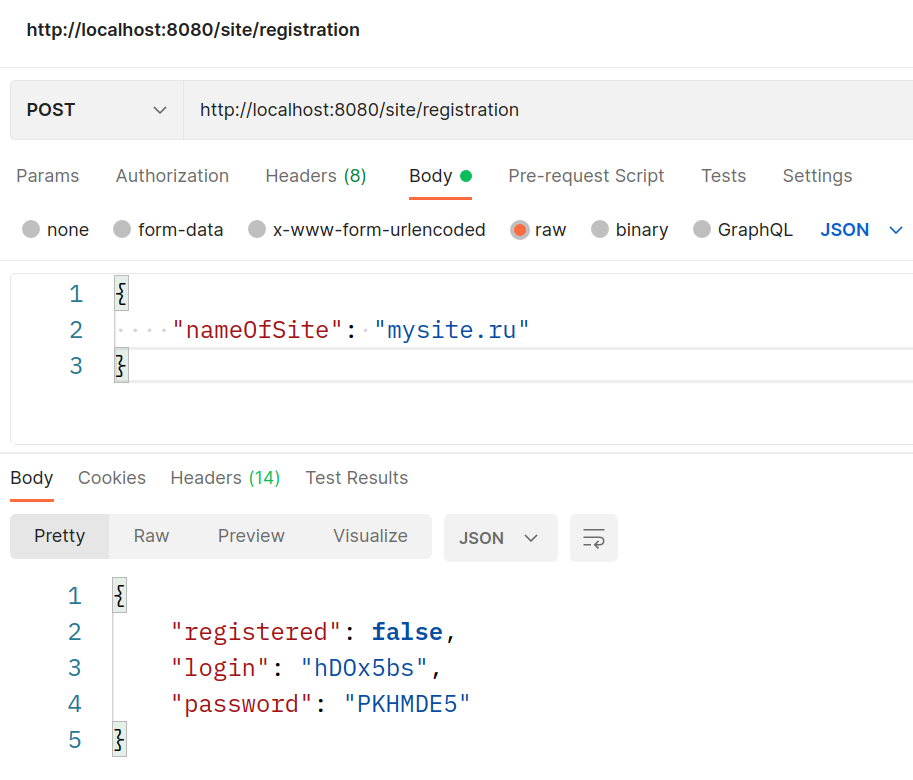
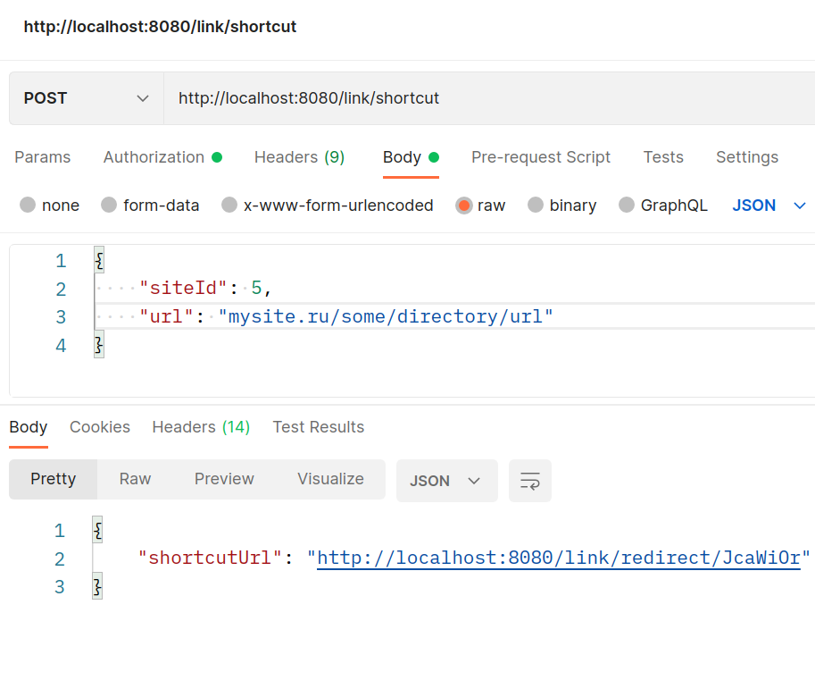
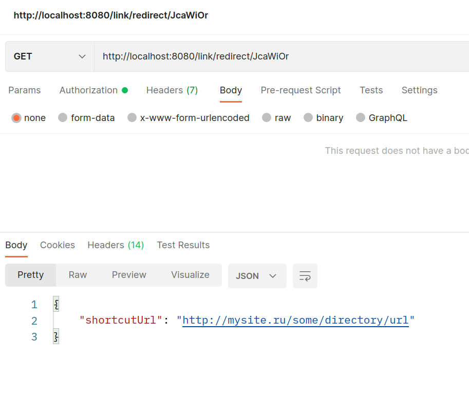
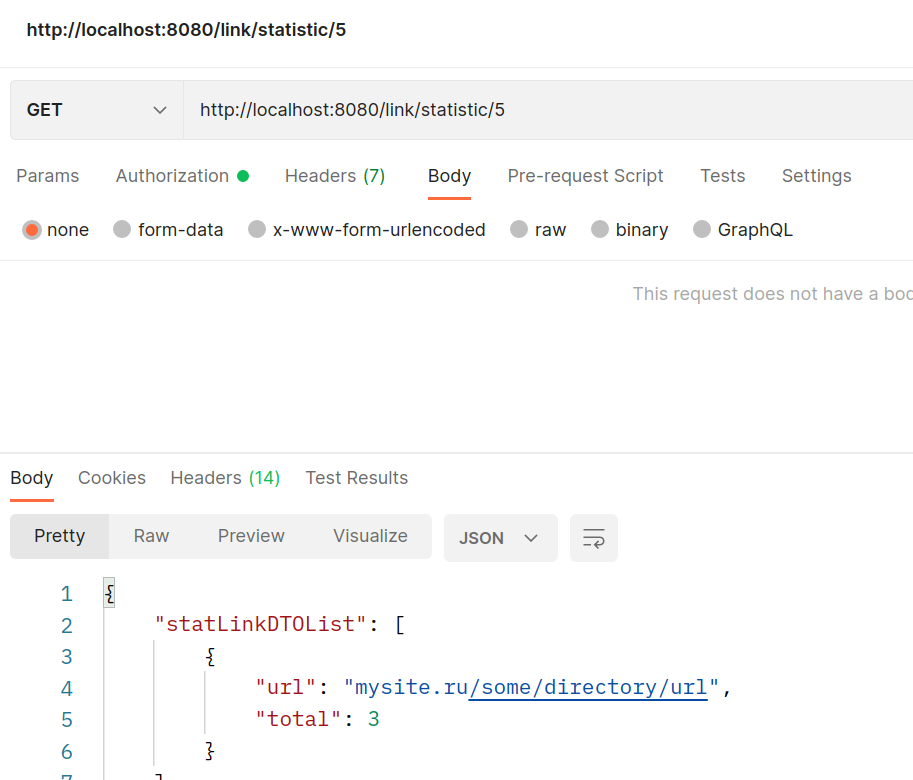

# Приложение ShortcutURL

## О проекте.
#### Описание
Приложение реализует функционал web-сервиса по сокращению ссылок. 

#### Технологии
> JDK14, Maven, Spring Boot, PostgreSQL, Liquibase, JWT

## Сборка.
0. Скачать файлы репозитория
1. Произвести сборку проекта: `mvn clean install`
2. Скопировать полученный файл "url_shortcut-1.0.jar" из папки target в папку вашего сервера

## Запуск через Docker Compose
1. Создать директорию на сервере и скопировать файлы репозитория
2. Перейти в созданную директорию (корень проекта) и собрать приложение командой: `mvn install`
3. Собирать docker-образ приложения командой: `docker build -t shortcut .`
4. При необходимости отредактировать порты, используемые приложением в файле docker-compose.yml
5. Запустить приложение командой: `docker-compose up`

## Запуск в кластере K8s
Файлы конфигурации *.yml находятся в корне проекта, в директории k8s
1. Создаем Secret: `kubectl apply -f postgresdb-secret.yml`
2. Создаем ConfigMap: `kubectl apply -f postgresdb-configmap.yml`
3. Создаем Deployment для БД: `kubectl apply -f postgresdb-deployment.yml`
4. Создаем Deployment для Spring Boot: `kubectl apply -f spring-deployment.yml`

## Как пользоваться.
После старта приложения необходимо зарегистрироваться в нем, либо ввести свои логин и пароль.
Регистрация производится по названию сайта, например: `mysite.ru`.

После регистрации для пользователя генерируются логин и пароль для доступа с систему. 
Их необходимо сохранить для дальнейшего входа в систему. 
Флаг "registered" означает, был ли пользователь ранее зарегистрирован в системе.

После входа в систему пользователю присваивается уникальный токен,
т.к. приложение использует JWT аутентификацию и авторизацию.

Для получения сокращенной ссылки необходимо выполнить запрос, передав в нем 
исходную ссылку. Поле "siteId" - это уникальный идентификатор пользователя, 
который присваивается ему при регистрации. 
Глубина ссылки не имеет значения. Результат будет отправлен в теле ответа.

  

Важно учитывать, что корневой адрес исходной ссылки должен быть таким же
как название сайта указанное при регистрации, например:

    адрес, указанный при регистрации - site.ru
    адрес, который можно использовать - site.ru/***
    адрес, который нельзя использовать - some-address.ru/***

Если воспользоваться полученной ссылкой, произойдет перенаправление по исходному url адресу

Приложение ведет статистику по количеству обращений к каждой хранящейся ссылке.
Для получения статистики необходимо выполнить соответствующий запрос.

  
## Контакты.
Кутявин Владимир Анатольевич

skype: tribuna87

email: tribuna87@mail.ru

telegram: @kutiavinvladimir