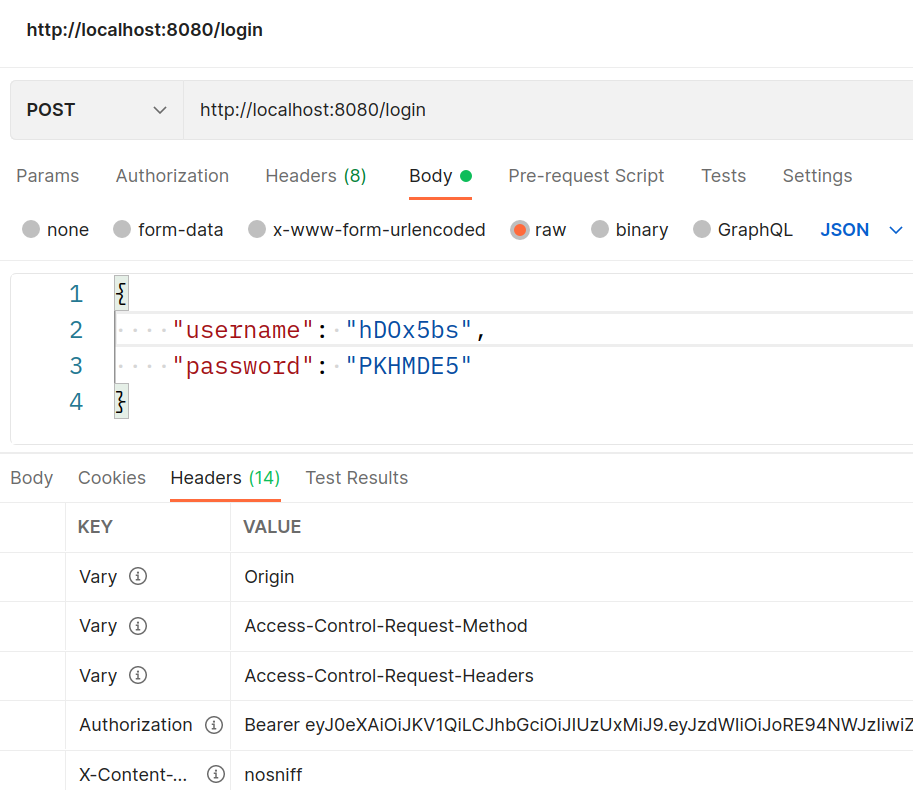

# Application ShortcutURL

## About project.
#### Desc
The application implements the functionality of a REST service for shortening links. Allows the user to receive shortened links to their site.
When using a shortened link, the service will redirect to the original URL.
Interaction with the service occurs through simple http requests.

#### Technology
> JDK14, Maven, Spring Boot 2, Spring Data JPA, PostgreSQL, Liquibase, Spring Security, JWT, REST API

## Init.
0. Download repository files
1. Build the project: `mvn clean install`
2. Copy the resulting file "url_shortcut-1.0.jar" from the target folder to your server folder

## Working with docker
1. Create a directory on the server and copy the repository files
2. Go to the created directory (project root) and build the application with the command: `mvn install`
3. Build the docker image of the application with the command: `docker build -t shortcut .`
4. If necessary, edit the ports used by the application in the docker-compose.yml file
5. Run the application with the command: `docker-compose up`

## Running in a K8s cluster
The *.yml configuration files located in the root of the project, in the k8s directory
1. Create Secret: `kubectl apply -f postgresdb-secret.yml`
2. Create ConfigMap: `kubectl apply -f postgresdb-configmap.yml`
3. Create a Deployment for the database: `kubectl apply -f postgresdb-deployment.yml`
4. Create Deployment for Spring Boot: `kubectl apply -f spring-deployment.yml`

## How use
After starting the application, you need to register in it, or enter your username and password.
Registration is made by the name of the site, for example: `mysite.ru`.

After registration, a username and password are generated for the user to access the system.
They must be saved for further login.
The flag "registered" means whether the user was previously registered in the system.

After logging in, the user is assigned a unique token,
because the application uses JWT authentication and authorization.

To get a shortened link, you need to execute a request by passing in it
original link. The "siteId" field is a unique user identifier,
assigned to him upon registration.
Link depth doesn't matter. The result will be sent in the response body.

  

It is important to consider that the root address of the original link must be the same
as the name of the site specified during registration, for example:

    address specified during registration - site.ru
    address that can be used - site.ru/***
    address that cannot be used - some-address.ru/***

If you use the received link, you will be redirected to the original url address

The application maintains statistics on the number of hits to each stored link.
To get statistics, you need to execute the corresponding query.

  
## Contact.
Kutiavin Vladimir

telegram: @kutiavinvladimir
